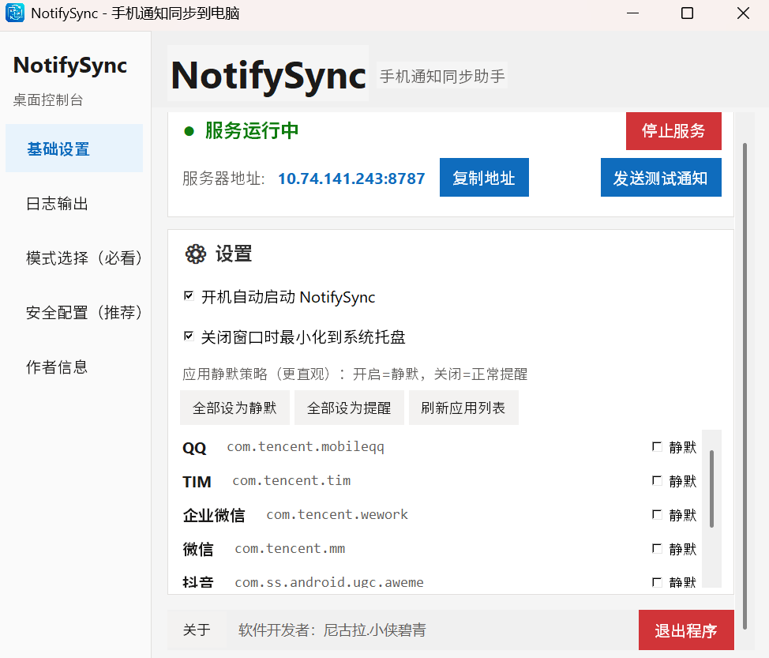
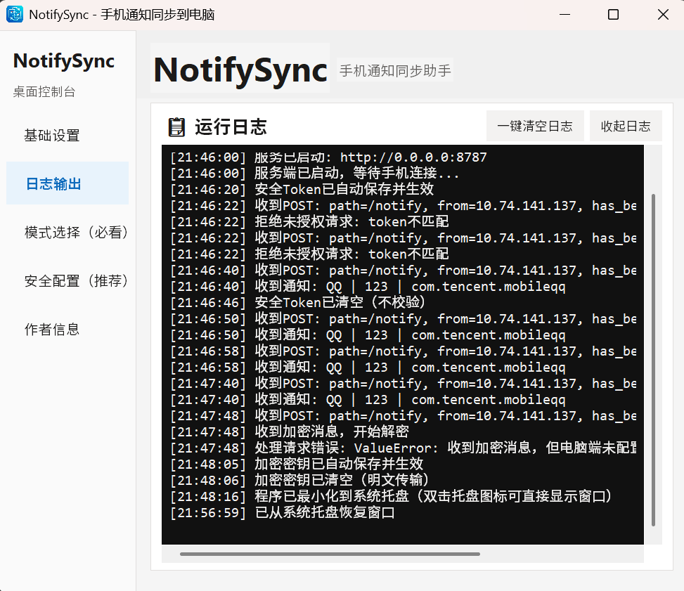
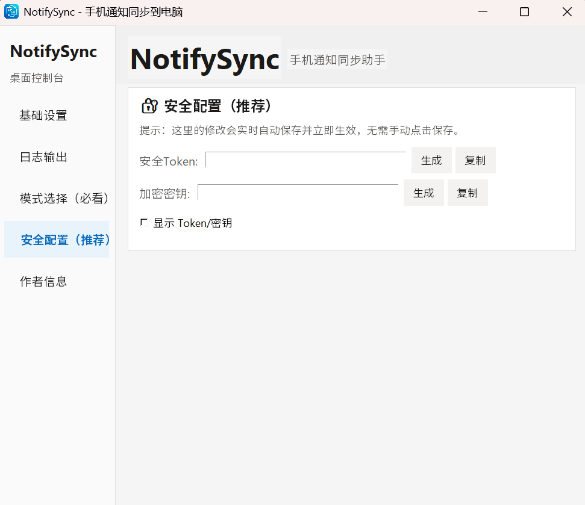
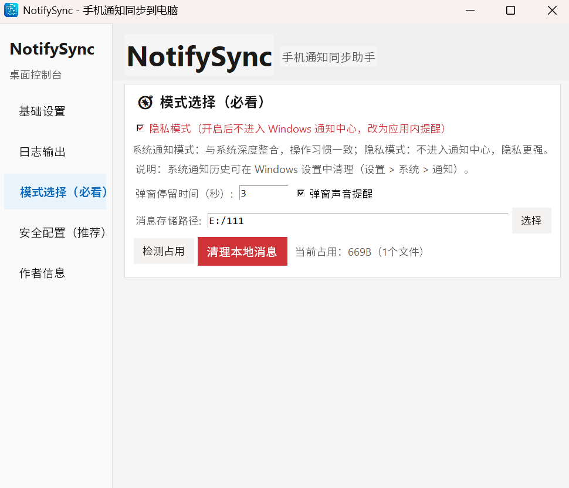
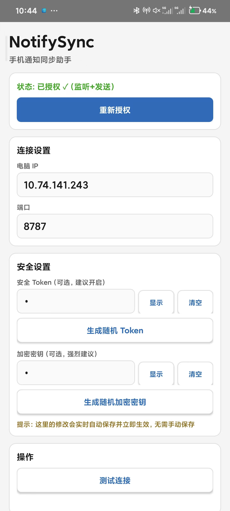

<div align="center">


# NotifySync

**将安卓手机通知实时同步到 Windows 通知栏**

[](https://opensource.org/licenses/MIT)
[](https://github.com/xiabiqing/NotifySync)
[](https://github.com/xiabiqing/NotifySync/releases)
[](https://github.com/xiabiqing/NotifySync/stargazers)

📱 **实时同步** · 🔒 **安全可靠** · 🖥️ **原生体验** · ⚙️ **开机自启**

[📥 下载 Windows 版](https://github.com/xiabiqing/NotifySync/releases/latest/download/NotifySync.exe) · [📥 下载安卓版](https://github.com/xiabiqing/NotifySync/releases/latest/download/app-debug.apk) · [📖 使用说明](docs/USAGE.md)

</div>

---

## ✨ 为什么需要 NotifySync？

| 场景 | 痛点 | NotifySync 解决方案 |
|------|------|---------------------|
| 💼 **工作沟通** | Boss直聘、企业微信消息频繁，频繁看手机影响效率 | 消息直接显示在电脑通知栏，工作不中断 |
| 🛒 **二手交易** | 闲鱼消息错过，买家被抢走 | 实时同步到电脑，第一时间回复 |
| 🔐 **验证码** | 登录时需要拿起手机看验证码 | 验证码直接弹窗显示在电脑屏幕 |
| 📢 **重要提醒** | 手机静音时错过重要通知 | 电脑端声音+弹窗双重提醒 |

---

## 📸 界面预览

### Windows 服务端

<div align="center">
<table>
<tr>
<td><br><center>基础设置 - 服务控制与应用管理</center></td>
<td><br><center>日志输出 - 实时查看通知记录</center></td>
</tr>
<tr>
<td><br><center>安全配置 - Token与加密密钥</center></td>
<td><br><center>模式选择 - 系统通知/隐私模式</center></td>
</tr>
</table>
</div>

### Android 客户端

<div align="center">
<br>
<center>Material Design 风格界面 - 简洁美观，操作便捷</center>
</div>

---

## 🚀 快速开始（3分钟搞定）

```bash
# 1. 电脑端（Windows）
下载 NotifySync.exe → 双击运行 → 复制显示的 IP:端口

# 2. 手机端（Android）
安装 APK → 授予通知权限 → 输入电脑 IP:端口 → 测试连接

# 3. 开始使用！
手机收到任何通知，电脑立即显示
```

### 详细步骤

<details>
<summary>点击查看详细图文教程</summary>

#### Windows 端

1. 从 [Releases](https://github.com/xiabiqing/NotifySync/releases) 下载 `NotifySync.exe`
2. 双击运行，首次运行若出现防火墙提示，请**允许局域网访问**
3. 记录界面显示的 `IP:端口`（如 `192.168.1.100:8787`）
4. 点击「复制地址」按钮复制到剪贴板

#### Android 端

1. 从 [Releases](https://github.com/xiabiqing/NotifySync/releases) 下载 `app-debug.apk`
2. 安装 APK（可能需要在设置中允许安装未知来源应用）
3. 打开应用，点击「开启通知权限」，在系统设置中授权
4. 返回应用，输入电脑端显示的 IP 和端口
5. 点击「测试连接」，成功后即可正常使用

> 💡 **提示**：确保手机和电脑连接在同一 Wi-Fi 网络下

</details>

---

## 🎯 核心功能

| 功能 | 描述 | 状态 |
|------|------|------|
| 📱 **实时同步** | 手机收到通知瞬间，电脑立即显示 | ✅ 可用 |
| 🔒 **Token 鉴权** | 防止未授权设备连接 | ✅ 可用 |
| 🔐 **AES 加密** | 通知内容端到端加密传输 | ✅ 可用 |
| 🖥️ **系统通知** | 融入 Windows 11 通知中心 | ✅ 可用 |
| 🔕 **隐私模式** | 不进入通知中心，应用内提醒 | ✅ 可用 |
| ⚙️ **开机自启** | 支持系统托盘后台运行 | ✅ 可用 |
| 📊 **智能静默** | 根据电脑运行应用自动静音 | ✅ 可用 |
| 📝 **日志记录** | 完整记录通知历史 | ✅ 可用 |

---

## 🛠️ 技术栈

### Windows 端
- **Python 3.8+** - 核心逻辑
- **tkinter** - 现代化 GUI 界面
- **pystray** - 系统托盘支持
- **win11toast** - Windows 11 原生通知
- **PyInstaller** - 打包成独立 EXE

### Android 端
- **Java** - 原生开发
- **NotificationListenerService** - 系统通知监听
- **Material Design 3** - 现代 UI 设计
- **AES-GCM** - 端到端加密

---

## 🔧 自行构建

### Windows EXE 打包

```bash
cd windows
pip install pyinstaller pystray pillow win11toast pycryptodome
python build_exe.py
# 输出: dist/NotifySync.exe
```

### Android APK 构建

1. 用 Android Studio 打开 `android/` 文件夹
2. 同步 Gradle（Sync Project with Gradle Files）
3. Build → Build Bundle(s) / APK(s) → Build APK(s)
4. 在 `app/build/outputs/apk/debug/` 中找到 APK

详细构建说明见 [BUILD_GUIDE.md](BUILD_GUIDE.md)

---

## 📡 通信协议

安卓端通过 HTTP POST 发送通知数据到 Windows：

```json
{
  "id": "notification_key",
  "appName": "微信",
  "packageName": "com.tencent.mm",
  "title": "张三",
  "text": "你好，在吗？",
  "subText": "",
  "time": 1712654321000
}
```

支持可选的 AES-GCM 加密，确保局域网传输安全。

---

## ⚠️ 安全与隐私

- ✅ **仅在局域网传输**，不经过任何第三方服务器
- ✅ **支持 Token 鉴权**，防止未授权连接
- ✅ **支持 AES 加密**，通知内容加密传输
- ✅ **可选隐私模式**，敏感通知不进入系统通知中心
- ⚠️ **不建议将端口暴露到公网**

详细免责声明见 [使用说明与免责声明.md](使用说明与免责声明.md)

---

## 🤝 贡献

欢迎提交 Issue 和 Pull Request！

1. Fork 本仓库
2. 创建你的特性分支 (`git checkout -b feature/AmazingFeature`)
3. 提交更改 (`git commit -m 'Add some AmazingFeature'`)
4. 推送到分支 (`git push origin feature/AmazingFeature`)
5. 打开一个 Pull Request

### 贡献者

感谢所有为这个项目做出贡献的人！

<a href="https://github.com/xiabiqing/NotifySync/graphs/contributors">
  
</a>

---

## 📄 开源协议

本项目采用 [MIT](LICENSE) 协议开源。

---

## 👤 作者

- **尼古拉.小侠碧青**
- GitHub: [@xiabiqing](https://github.com/xiabiqing)
- 微信: xiabiqing1
- QQ: 2632493933

---

<div align="center">

### 如果这个项目对你有帮助，请给个 ⭐ Star 支持一下！

[](https://star-history.com/#xiabiqing/NotifySync&Date)

</div>
